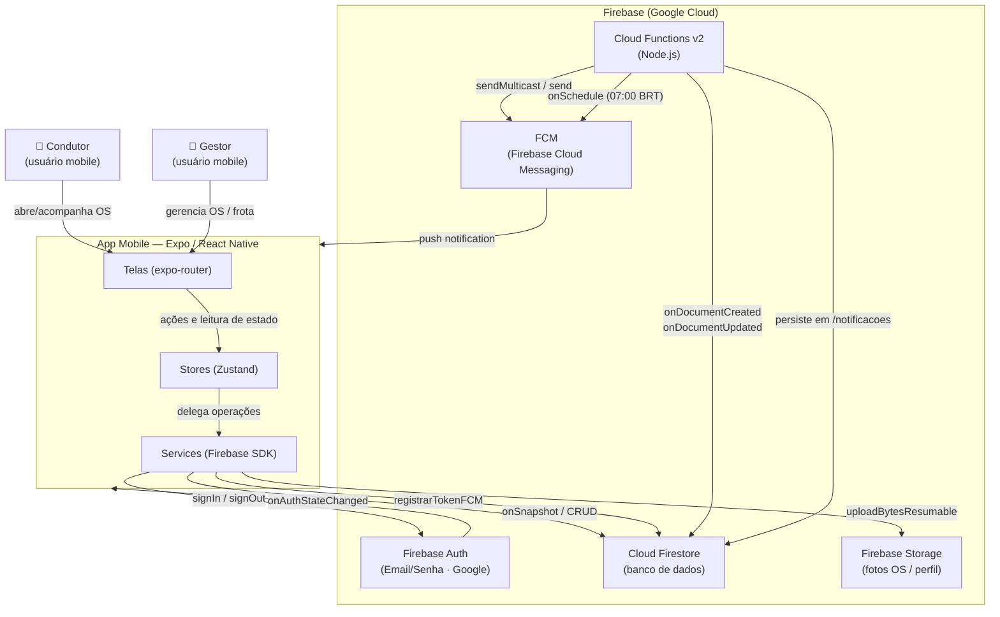

# Arquitetura — FrotaAtiva

> Documento gerado em 2026-05-17. Fonte: leitura direta dos arquivos do repositório.

---

## 1. Visão Geral

O FrotaAtiva é um aplicativo móvel de gestão de manutenção de frota voltado para empresas brasileiras. Ele digitaliza o processo de abertura, acompanhamento e encerramento de Ordens de Serviço (OS), substituindo fluxos informais conduzidos via WhatsApp por um sistema estruturado com rastreabilidade de status, registro fotográfico e notificações em tempo real.

O sistema opera com dois perfis distintos. O **condutor** é o motorista responsável pelo veículo: ele abre uma OS em até seis etapas, informa a placa, o hodômetro, os serviços desejados, fotos e a data/horário preferidos para atendimento. O **gestor** é o responsável pela frota: ele recebe notificações de novas OS, atribui fornecedores, avança o status do serviço, registra os serviços efetivamente realizados com seus valores e aprova ou recusa orçamentos. Ambos acompanham o andamento em tempo real via subscriptions do Firestore.

O problema central resolvido é a ausência de rastreabilidade: sem o app, as solicitações de manutenção se perdiam em conversas de WhatsApp, sem histórico de status, sem registro de custos e sem visibilidade gerencial da frota. O FrotaAtiva centraliza tudo em um backend Firebase acessível por qualquer dispositivo, com notificações push automáticas acionadas por Cloud Functions.

### Personas e responsabilidades

| Persona | Perfil no Firestore | Responsabilidades |
|---|---|---|
| Condutor | `perfil: 'condutor'` | Abrir OS, acompanhar status, visualizar histórico das próprias OS |
| Gestor | `perfil: 'gestor'` | Gerenciar OS (status, fornecedor, nota), cadastrar veículos/fornecedores, criar contas de condutor, visualizar dashboard analítico |

---

## 2. Stack Tecnológica

| Camada | Tecnologia | Versão | Justificativa |
|---|---|---|---|
| Runtime JS | React Native | 0.81.5 | Base do Expo SDK 54; nova arquitetura ativada (`newArchEnabled: true`) |
| Framework mobile | Expo SDK | ~54.0.33 | Build gerenciado via EAS; simplifica configuração nativa |
| Linguagem | TypeScript | ~5.9.2 | Tipagem estática; modo `strict` habilitado |
| UI / Design System | react-native-paper (MD3) | ^5.15.1 | Componentes Material Design 3 prontos; tema customizável |
| Roteamento | expo-router (file-based) | ~6.0.23 | Roteamento declarativo por convenção de arquivos; typedRoutes ativado |
| Estado global | Zustand | ^5.0.12 | API minimalista; evita boilerplate do Redux |
| Formulários | react-hook-form + zod | ^7.72.1 / ^4.3.6 | Validação declarativa com schema; integração via `@hookform/resolvers` |
| Backend / Banco | Firebase Firestore | ^12.12.0 (JS SDK) | BaaS; subscriptions em tempo real via `onSnapshot` |
| Autenticação | Firebase Auth | ^12.12.0 | Email/senha + Google Sign-In (builds nativos) |
| Storage | Firebase Storage | ^12.12.0 | Upload de fotos de OS e perfil |
| Notificações push | @react-native-firebase/messaging (FCM) | ^24.0.0 | Módulo nativo; não funciona no Expo Go |
| Lógica server-side | Firebase Cloud Functions v2 | (firebase-admin ^13.8.0) | Triggers Firestore + scheduler para notificações e lembretes |
| Animações | react-native-reanimated | ~4.1.1 | Animações nativas de alta performance |
| Data/hora | date-fns (ptBR) | ^4.1.0 | Formatação e manipulação de datas em português brasileiro |
| Detecção de rede | @react-native-community/netinfo | 11.4.1 | Feedback de conectividade nas telas que exigem rede |
| Build / CI | EAS (Expo Application Services) | (eas.json) | Build e distribuição gerenciados pelo Expo |
| Lint | ESLint + eslint-config-expo | ^9.25.0 | Regras padrão do ecossistema Expo |

---

## 3. Diagrama de Containers (C4 Nível 2)



---

## 4. Estrutura de Diretórios

```
frotaAtiva/
├── app/                  # Rotas e telas (expo-router — file-based routing)
│   ├── (tabs)/           # Grupo de abas; visibilidade condicional por perfil
│   ├── nova-os/          # Fluxo de criação de OS em 6 etapas
│   └── os/[id]/          # Detalhe e gerenciamento de uma OS específica
├── components/           # Componentes React reutilizáveis (sem lógica de negócio)
├── constants/            # Tokens de design (cores, status) e categorias de serviço
├── data/                 # Dados estáticos (lista de municípios brasileiros)
├── docs/                 # Documentação do projeto
├── functions/            # Cloud Functions (Node.js / firebase-functions v2)
│   └── src/              # Código-fonte das functions (index.ts)
├── hooks/                # Custom hooks React (auth listener, push, conectividade)
├── lib/                  # Inicialização do Firebase SDK (singleton)
├── mocks/                # Artefato legado — não importado em nenhum arquivo
├── services/             # Camada de acesso ao Firebase (Firestore, Auth, Storage)
├── store/                # Stores Zustand (auth, novaOS, notification)
├── types/                # Tipos TypeScript globais (OrdemServico, AppUser, etc.)
└── assets/               # Imagens, ícones e splash screen
```

---

## 5. Arquitetura de Estado (Zustand)

### `auth.store.ts` — `useAuthStore`

**Responsabilidade:** Gerenciar a sessão do usuário autenticado. É a fonte de verdade para `currentUser` em toda a aplicação.

**Estado principal:**
- `currentUser: AppUser | null` — usuário autenticado (com perfil Firestore enriquecido)
- `loading: boolean` — `true` até o primeiro disparo de `onAuthStateChanged`
- `error: string | null` — mensagem de erro de autenticação traduzida para pt-BR

**Ações principais:**
- `login(email, password)` — autentica via email/senha; registra FCM token
- `loginWithGoogle(idToken)` — autentica via Google ID Token; registra FCM token
- `logout()` — encerra sessão Firebase e limpa estado
- `updatePhoto(uri, onProgress)` — faz upload para Storage e sincroniza `photoURL` no Auth e Firestore
- `setUser(user)` — chamado exclusivamente pelo `useAuthListener`; nunca pela UI diretamente

---

### `novaOS.store.ts` — `useNovaOSStore`

**Responsabilidade:** Acumular o estado do formulário multi-etapa de abertura de OS enquanto o usuário avança pelas 6 telas. Funciona como um formulário compartilhado entre rotas independentes.

**Estado principal:**
- `placa`, `hodometro`, `cidade` — etapa 1
- `servicosSelecionados: string[]` — etapa 2 (IDs do catálogo)
- `descricao`, `fotos: string[]` — etapa 3
- `dataDesejada`, `horario`, `observacoes` — etapa 4

**Ações principais:**
- Setters individuais por campo (`setPlaca`, `setHodometro`, etc.)
- `reset()` — limpa todo o estado ao concluir ou cancelar a OS

---

### `notification.store.ts` — `useNotificationStore`

**Responsabilidade:** Armazenar o FCM token do dispositivo atual para acesso em memória sem necessidade de releitura do Firestore.

**Estado principal:**
- `fcmToken: string | null`

**Ações principais:**
- `setFcmToken(token)` — atualizado pelo hook `usePushNotifications` após registro FCM

---

## 6. Camada de Serviços

### `auth.service.ts`

**Responsabilidade:** Toda operação de autenticação Firebase e leitura/escrita do perfil de usuário no Firestore. Componentes e stores nunca importam `firebase/auth` diretamente.

**Dependências:** `firebase/auth`, `firebase/firestore`, `lib/firebase`, `storage.service`

**Observações:**
- `createUserAccount` usa instância Firebase secundária (`initializeApp` + `deleteApp`) para não deslogar o gestor ao criar uma conta de condutor.
- `buildAppUser` bloqueia o login se `ativo === false`, encerrando a sessão antes de retornar erro.
- Múltiplos `TODO: replace with api.post/get(...)` indicam intenção futura de migrar para uma REST API própria.

---

### `os.service.ts`

**Responsabilidade:** CRUD e subscriptions em tempo real da coleção `ordens-servico`.

**Dependências:** `firebase/firestore`, `lib/firebase`

**Observações:**
- Define `ACTIVE_STATUSES` e aplica `where('status', 'in', ACTIVE_STATUSES)` em todas as queries — OS concluídas são excluídas de todas as listas ativas.
- Ordenação é sempre feita client-side (`byDate`) para evitar a necessidade de índices compostos no Firestore.
- `computeMetrics` agrega métricas (total por status, gastos por tipo) diretamente dos dados carregados em memória.
- O limite padrão de `subscribeToAllOS` é 100 documentos; comentário no código alerta para paginação em frotas grandes.

---

### `fornecedor.service.ts`

**Responsabilidade:** CRUD e subscriptions da coleção `fornecedores`. Inclui paginação cursor-based (`startAfter`) para listagem paginada e subscription em tempo real para o mapa de fornecedores usado nos `OSCard`.

**Dependências:** `firebase/firestore`, `lib/firebase`

**Observações:**
- Limite fixo de 500 documentos na subscription (`FORNECEDORES_LIMIT`). Paginação de 25 itens por página (`FORNECEDORES_PAGE_SIZE`) para a tela de listagem.

---

### `veiculo.service.ts`

**Responsabilidade:** CRUD e subscriptions da coleção `veiculos`. Inclui busca por placa com normalização (com e sem hífen).

**Dependências:** `firebase/firestore`, `lib/firebase`

**Observações:**
- `getVeiculoByPlaca` consulta ambas as variantes de formatação da placa (ex.: `ABC1234` e `ABC-1234`) em um único round-trip via `where('placa', 'in', candidates)`.
- Mesmo padrão de limite (500) e paginação (25) que `fornecedor.service.ts`.

---

### `catalogo.service.ts`

**Responsabilidade:** CRUD da coleção `catalogo-servicos`. Gestores cadastram serviços; condutores selecionam ao abrir OS.

**Dependências:** `firebase/firestore`, `lib/firebase`

**Observações:**
- `toggleServico` permite desativar um serviço sem excluí-lo (`ativo: false`).
- `getServicosAtivos` filtra client-side pelo campo `ativo`.

---

### `notificacoes.service.ts`

**Responsabilidade:** Leitura e marcação como lida de notificações da coleção `notificacoes`. A **criação** de notificações é responsabilidade exclusiva das Cloud Functions.

**Dependências:** `firebase/firestore`, `lib/firebase`

**Observações:**
- Notificações expiram em 90 dias (campo `expiresAt`). A limpeza automática de expiradas não está implementada no cliente — depende de uma futura Cloud Function agendada ou TTL do Firestore.

---

### `notification.service.ts`

**Responsabilidade:** Registrar o FCM token do dispositivo no Firestore (`usuarios/{uid}.fcmToken`). Atualiza automaticamente quando o token é rotacionado via `onTokenRefresh`.

**Dependências:** `@react-native-firebase/messaging` (native, `require()` condicional), `expo-notifications`, `firebase/firestore`

**Observações:**
- Usa `require()` condicional para não quebrar no Expo Go, onde módulos nativos Firebase não são carregados.
- No Android, cria o canal de notificação `os-updates` com prioridade HIGH antes de solicitar o token.

---

### `storage.service.ts`

**Responsabilidade:** Upload de fotos de OS e foto de perfil para Firebase Storage.

**Dependências:** `firebase/storage`, `lib/firebase`

**Observações:**
- Upload de fotos de OS é feito em paralelo (`Promise.all`) com progresso agregado.
- Foto de perfil sobrescreve sempre o mesmo path `perfil-fotos/{uid}` — não há acúmulo de versões antigas.
- `deleteFotosOS` usa `Promise.allSettled` para falha silenciosa por arquivo.

---

## 7. Navegação

### Estrutura de rotas (expo-router)

```
/                          → app/index.tsx           (redirect baseado em auth)
/login                     → app/login.tsx
/novo-usuario              → app/novo-usuario.tsx     (gestor cria condutor)
/perfil                    → app/perfil.tsx
/notificacoes              → app/notificacoes.tsx
/catalogo-servicos         → app/catalogo-servicos.tsx (gestor)

/(tabs)
  /                        → app/(tabs)/index.tsx     (CondutorHome ou GestorDashboard)
  /veiculos                → app/(tabs)/veiculos.tsx   (gestor; href: null p/ condutor)
  /fornecedores            → app/(tabs)/fornecedores.tsx (gestor; href: null p/ condutor)
  /configuracoes           → app/(tabs)/configuracoes.tsx
  /profile                 → app/(tabs)/profile.tsx    (href: null — desativada)
  /explore                 → app/(tabs)/explore.tsx    (href: null — legado Expo template)

/nova-os
  /etapa-1                 → placa, hodômetro, cidade
  /etapa-2                 → seleção de serviços do catálogo
  /etapa-3                 → descrição e upload de fotos
  /etapa-4                 → data desejada, horário, observações
  /etapa-5                 → resumo / confirmação
  /etapa-6                 → confirmação final / submissão

/os/[id]
  /                        → detalhe da OS (ambos os perfis)
  /gerenciar               → gestor: atribuir fornecedor, alterar status, adicionar nota
```

### Separação por perfil

A separação é feita em `app/(tabs)/_layout.tsx` via `currentUser.perfil`:

- **Condutor:** vê as abas "Início" e "Configurações". As abas Veículos e Fornecedores têm `href: null`.
- **Gestor:** vê as abas "Painel", "Veículos", "Fornecedores" e "Configurações".

O guard de autenticação está no layout de tabs: se `currentUser` for nulo, redireciona para `/login`.

### Fluxo do stepper (nova OS)

O estado do formulário é mantido em `useNovaOSStore` (Zustand) durante toda a navegação entre etapas. Cada etapa (`etapa-1.tsx` a `etapa-6.tsx`) lê e escreve no store. Ao concluir a etapa 6, o serviço `os.service.ts` persiste a OS e o store é limpo via `reset()`. O fluxo está envolto por `app/nova-os/_layout.tsx` (Stack wrapper).

---

## 8. Backend Firebase

### 8.1 Cloud Functions

#### `onOSCreated`

- **Trigger:** `onDocumentCreated` em `ordens-servico/{id}`
- **Coleção observada:** `ordens-servico`
- **O que faz:** Ao criar uma nova OS, busca todos os gestores com `fcmToken` registrado e envia notificação multicast via FCM.
- **Side effects:**
  - Envia push notification para todos os gestores (lotes de 500 tokens).
  - Persiste uma entrada em `notificacoes` para cada gestor destinatário (tipo `os_criada`, TTL 90 dias).
  - Remove automaticamente do Firestore tokens FCM permanentemente inválidos (stale tokens).

#### `onOSStatusUpdated`

- **Trigger:** `onDocumentUpdated` em `ordens-servico/{id}`
- **Coleção observada:** `ordens-servico`
- **O que faz:** Detecta mudança no campo `status`; se houve mudança, envia notificação unicast para o condutor dono da OS com mensagem específica por status.
- **Side effects:**
  - Envia push notification para o condutor.
  - Persiste uma entrada em `notificacoes` para o condutor (tipo `status_atualizado`, TTL 90 dias).
  - Remove token stale do condutor se FCM retornar erro permanente.

#### `enviarLembretesOS`

- **Trigger:** `onSchedule` — executa diariamente às 07:00 (fuso `America/Sao_Paulo`)
- **Coleção observada:** `ordens-servico` (OS ativas com `dataDesejada` igual ao dia atual e sem `lembreteEnviadoEm`)
- **O que faz:** Filtra OS ativas cuja `dataDesejada` corresponde ao dia corrente em horário de Brasília (UTC-3) e que ainda não receberam lembrete.
- **Side effects:**
  - Envia push notification para o condutor de cada OS candidata.
  - Persiste uma entrada em `notificacoes` (tipo `lembrete_os`, TTL 90 dias).
  - Marca a OS com `lembreteEnviadoEm` (serverTimestamp) para evitar reenvio.

---

### 8.2 Autenticação

**Provedores utilizados:**
- **Email/Senha** — disponível em todas as builds (Expo Go incluso).
- **Google Sign-In** — disponível apenas em builds nativas (não Expo Go). Requer as variáveis de ambiente `EXPO_PUBLIC_GOOGLE_*_CLIENT_ID`. O componente `GoogleSignInButton` só renderiza quando todos os três IDs estão presentes e `Constants.appOwnership !== 'expo'`.

**Como o role é determinado:**
O role (`perfil`) não é armazenado no Firebase Auth. Após autenticação bem-sucedida, `buildAppUser` faz um `getDoc` em `usuarios/{uid}` no Firestore e retorna o perfil completo incluindo o campo `perfil: 'condutor' | 'gestor'`.

**Onde é armazenado:**
Campo `perfil` em `usuarios/{uid}` no Firestore. Novos usuários recebem `perfil: 'condutor'` por padrão. Promoção a `gestor` é feita manualmente via Firebase Console ou pelo próprio serviço de criação de conta (`createUserAccount`), que permite ao gestor definir o perfil ao criar a conta do novo usuário.

**Persistência de sessão:**
O Firebase JS SDK v12 usa `inMemoryPersistence`. Usuários precisam autenticar novamente após reiniciar o app no Expo Go. Builds nativas podem substituir por `AsyncStorage`.

---

### 8.3 Regras de Segurança

Arquivo: `firestore.rules`

| Coleção | Leitura | Escrita |
|---|---|---|
| `usuarios/{uid}` | Próprio usuário ou gestor | Próprio usuário ou gestor (delete: apenas gestor) |
| `ordens-servico/{id}` | Qualquer autenticado | Create: autenticado e `condutorId == request.auth.uid`; Update: qualquer autenticado |
| `fornecedores/{id}` | Qualquer autenticado | Apenas gestores |
| `veiculos/{id}` | Qualquer autenticado | Apenas gestores |
| `catalogo-servicos/{id}` | Qualquer autenticado | Apenas gestores |
| `notificacoes/{id}` | Autenticado e `userId == request.auth.uid` | Update restrito ao campo `read` (marcar como lida); create apenas via Cloud Functions (Admin SDK) |

A função auxiliar `isGestor()` faz um `get()` no documento do usuário para verificar o perfil — isso implica uma leitura adicional por operação protegida por essa função.

---

## 9. Decisões de Arquitetura (ADRs)

### ADR-001: Firebase como backend completo

**Contexto:** O app precisava de um backend com autenticação, banco de dados em tempo real, armazenamento de arquivos e notificações push, com time de desenvolvimento enxuto.

**Decisão:** Usar Firebase (Auth + Firestore + Storage + Cloud Functions + FCM) como backend completo, sem REST API própria.

**Consequências:**
- Positivo: zero infraestrutura a gerenciar; subscriptions em tempo real nativas do Firestore; integração FCM simplificada.
- Negativo: acoplamento ao ecossistema Google; custo escala com leituras/escritas; regras de segurança do Firestore são limitadas (ex.: `isGestor()` gera leitura extra por operação). Os `TODO: replace with api.post/get(...)` no `auth.service.ts` indicam que uma migração para REST API própria está prevista.

---

### ADR-002: Expo + React Native

**Contexto:** Necessidade de app iOS e Android com uma única base de código, sem equipe nativa dedicada.

**Decisão:** Usar Expo SDK 54 com nova arquitetura habilitada (`newArchEnabled: true`) e builds via EAS.

**Consequências:**
- Positivo: compartilhamento de código iOS/Android; EAS simplifica o pipeline de build; acesso a módulos nativos via dev-client.
- Negativo: módulos nativos (ex.: `@react-native-firebase/messaging`) não funcionam no Expo Go, exigindo `require()` condicional e guards `Constants.appOwnership === 'expo'` espalhados pelo código.

---

### ADR-003: expo-router com file-based routing

**Contexto:** O projeto usa Expo, que tem suporte nativo ao expo-router. A alternativa seria configurar React Navigation manualmente.

**Decisão:** Usar expo-router v6 com `typedRoutes: true` e `reactCompiler: true`.

**Consequências:**
- Positivo: roteamento por convenção de arquivos elimina boilerplate de configuração; deep links e navegação por notificação (`router.push('/os/${osId}')`) funcionam sem configuração adicional; rotas tipadas reduzem erros de navegação.
- Negativo: restrições do file-based routing (ex.: grupos `(tabs)`) podem ser menos óbvios para novos desenvolvedores.

---

### ADR-004: Zustand para state management

**Contexto:** O app tem estado global limitado (sessão de usuário, formulário multi-etapa, token FCM). Redux seria excessivo; Context API pode causar re-renders desnecessários em árvores grandes.

**Decisão:** Usar Zustand v5 com três stores focados: `auth.store`, `novaOS.store`, `notification.store`.

**Consequências:**
- Positivo: API mínima; sem boilerplate de actions/reducers; seletores granulares evitam re-renders desnecessários; fácil de testar unitariamente.
- Negativo: sem DevTools tão robustas quanto Redux; disciplina de não criar stores desnecessários fica a cargo do time.

---

### ADR-005: Cloud Functions para notificações push

**Contexto:** O FCM não permite que clientes enviem notificações diretamente para outros usuários sem expor credenciais de servidor. A alternativa seria um servidor intermediário próprio.

**Decisão:** Cloud Functions v2 com triggers Firestore (`onDocumentCreated`, `onDocumentUpdated`) e scheduler (`onSchedule`) disparam todas as notificações server-side via Admin SDK.

**Consequências:**
- Positivo: credenciais do servidor nunca expostas ao cliente; lógica de notificação centralizada; limpeza automática de stale tokens sem intervenção manual.
- Negativo: latência de cold start das functions; custo adicional por invocação; deploys separados (`cd functions && npm run deploy`).

---

### ADR-006: GoogleService-Info.plist na raiz do projeto

**Contexto:** Por padrão, o arquivo `GoogleService-Info.plist` deve estar em `ios/`. O `app.json` permite especificar um caminho alternativo via `ios.googleServicesFile`.

**Decisão:** Manter `GoogleService-Info.plist` (iOS) e `google-services.json` (Android) na raiz do projeto, referenciados em `app.json` como `"./GoogleService-Info.plist"` e `"./google-services.json"`.

**Consequências:**
- Positivo: arquivos ficam visíveis e acessíveis sem entrar na pasta `ios/` ou `android/`; facilita rotação de credenciais.
- Negativo: arquivos com credenciais na raiz são mais fáceis de commitar acidentalmente; `.gitignore` precisa contemplar ambos explicitamente.

---

### ADR-007: inMemoryPersistence no Firebase Auth

**Contexto:** O Firebase JS SDK v12 removeu `getReactNativePersistence`. A persistência padrão em ambiente React Native sem configuração explícita é em memória.

**Decisão:** Usar `inMemoryPersistence` explicitamente, aceitando que usuários precisam reautenticar após reiniciar o app no Expo Go.

**Consequências:**
- Positivo: sem dependência de AsyncStorage no SDK do Firebase; comportamento previsível.
- Negativo: UX degradada no Expo Go (reautenticação a cada restart). Builds nativas podem mitigar trocando para AsyncStorage persistence quando necessário.

---

### ADR-008: Filtragem de OS ativas com ordenação client-side

**Contexto:** Queries Firestore com `where('status', 'in', ...)` combinadas com `orderBy` em outro campo requerem índice composto configurado no console do Firebase.

**Decisão:** Todas as queries de OS omitem `orderBy` server-side e ordenam client-side via `byDate()`.

**Consequências:**
- Positivo: zero configuração de índices compostos; sem erros de índice faltante em novos ambientes.
- Negativo: em frotas muito grandes (>100 OS ativas), toda a ordenação é feita em memória no cliente. O limite atual de 100 documentos mitiga o problema a curto prazo.

---

## 10. Limitações Conhecidas e Débitos Técnicos

| # | Descrição | Severidade |
|---|---|---|
| 1 | **TODOs de migração para REST API** — `auth.service.ts` contém 5 comentários `TODO: replace with api.post/get(...)` em `getUserProfile`, `createUserProfile`, `signInWithEmail`, `signInWithGoogleIdToken` e `changePassword`. Indica que o acesso direto ao Firestore pelo cliente está previsto para ser encapsulado em uma API própria, mas não foi implementado. | `[MÉDIO]` |
| 2 | **Regra de update irrestrita em `ordens-servico`** — A regra `allow update: if isAuthenticated()` permite que qualquer usuário autenticado altere qualquer OS, incluindo OS de outros condutores. Não há validação de que apenas o condutor dono ou um gestor pode atualizar. | `[CRÍTICO]` |
| 3 | **Limite fixo de 100 OS ativas sem paginação** — `subscribeToAllOS` e `getAllOS` têm `limit(100)`. Em frotas com mais de 100 OS ativas simultâneas, OS mais antigas serão omitidas silenciosamente do dashboard do gestor. | `[MÉDIO]` |
| 4 | **`mocks/` — diretório legado não removido** — O diretório `mocks/` existe na raiz mas não é importado em nenhum arquivo. Permanece como artefato sem função, podendo causar confusão para novos desenvolvedores. | `[BAIXO]` |
| 5 | **`explore.tsx` — arquivo não utilizado** — `app/(tabs)/explore.tsx` é um remanescente do template padrão do Expo. Está desativado via `href: null` no layout, mas o arquivo permanece no repositório. | `[BAIXO]` |
| 6 | **`profile.tsx` — rota desativada nas abas** — `app/(tabs)/profile.tsx` tem `href: null` no layout de tabs. A rota de perfil está acessível via `app/perfil.tsx`. A permanência do arquivo pode gerar confusão sobre qual é a rota canônica de perfil. | `[BAIXO]` |
| 7 | **Sem suite de testes** — Não há configuração de runner de testes (Jest, Vitest, etc.) no projeto. Nenhum arquivo de teste foi identificado. | `[MÉDIO]` |
| 8 | **`isGestor()` nas regras Firestore gera leitura extra** — `isGestor()` usa `get(/usuarios/{uid})` para verificar o perfil, consumindo 1 leitura adicional por operação em: `usuarios` (read/create/update/delete), `fornecedores` (write), `veiculos` (write) e `catalogo-servicos` (write). **Solução canônica:** migrar para Firebase Auth Custom Claims (`request.auth.token.perfil == 'gestor'`), eliminando o `get()`. Requer Cloud Function `onUserProfileUpdated` que chame `admin.auth().setCustomUserClaims(uid, { perfil })` a cada mudança de perfil, e `getIdToken(true)` no cliente após promoção para forçar refresh do token (propagação natural leva até 1h). | `[MÉDIO]` |
| 9 | **Persistência de sessão degradada no Expo Go** — `inMemoryPersistence` força reautenticação a cada restart no Expo Go. Builds de desenvolvimento nativas (com `expo-dev-client`) não sofrem esse problema. | `[BAIXO]` |
